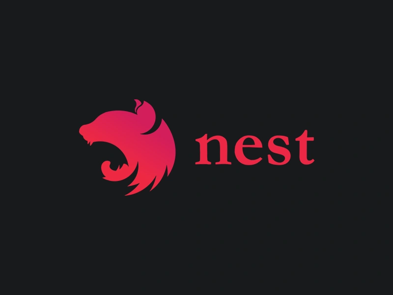

# Nest JS learning docs

`npm i -g @nestjs/cli`

This command installs the NestJS CLI.

`nest new project_name`

Creates new nestjs project with couple of prompts for package manager.

`nest new project_name -d` or literally any other command followed by `-d` flag is a _dry-run_ mode which just explains the steps which will be taken without executing them.

`nest generate --help` or any other command followed with the `--help` flag gives the docs for the NestJS CLI.

### Initial structure

`.prettierrc` , `eslint.config.mjs` and other configuration files are automatically populated with recommended settings and options.

Initial `src` directory structure is all connected leveraging the Dependency Injection mechanism.

`package.json` is configured to use jest for testing, all the development and build scripts.
